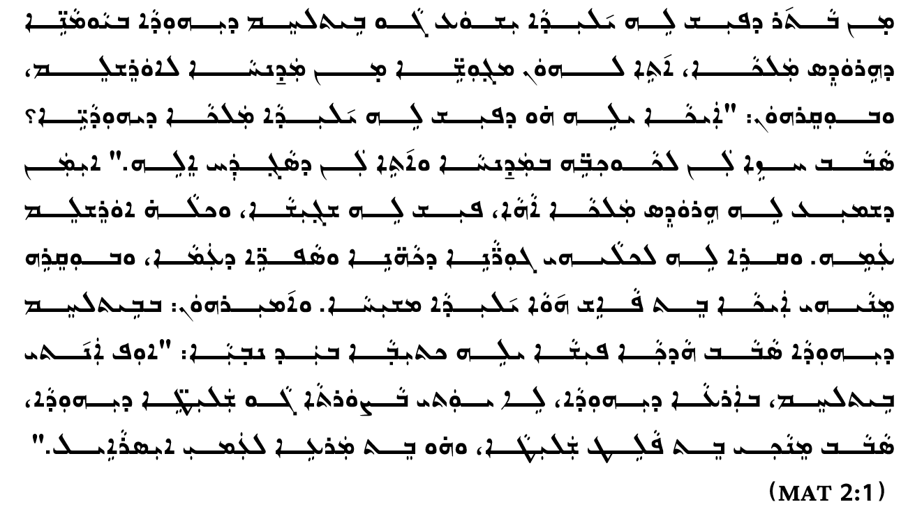
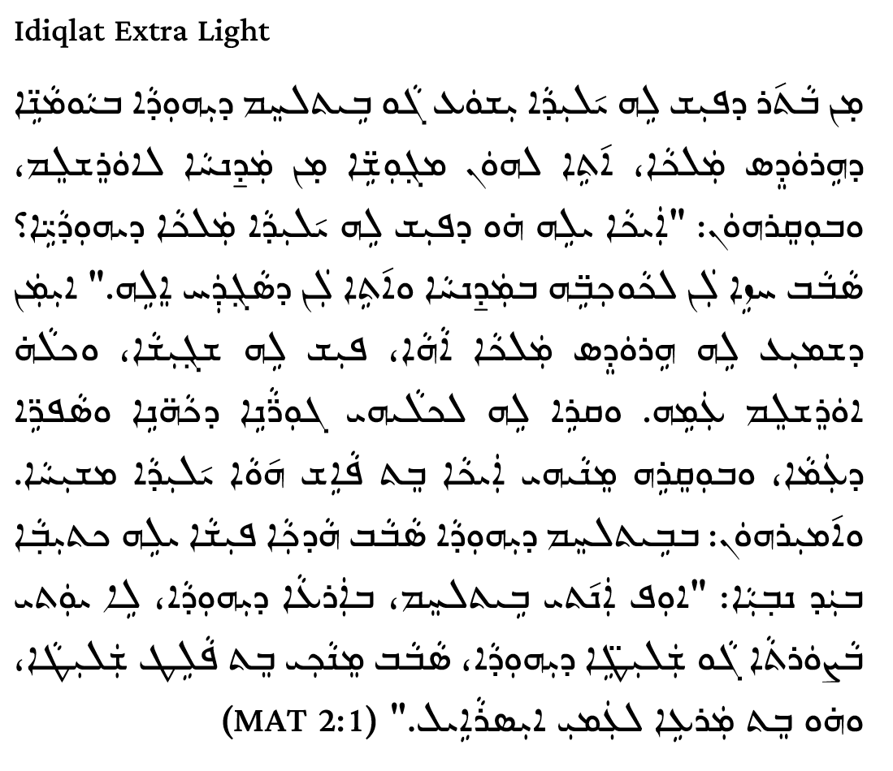
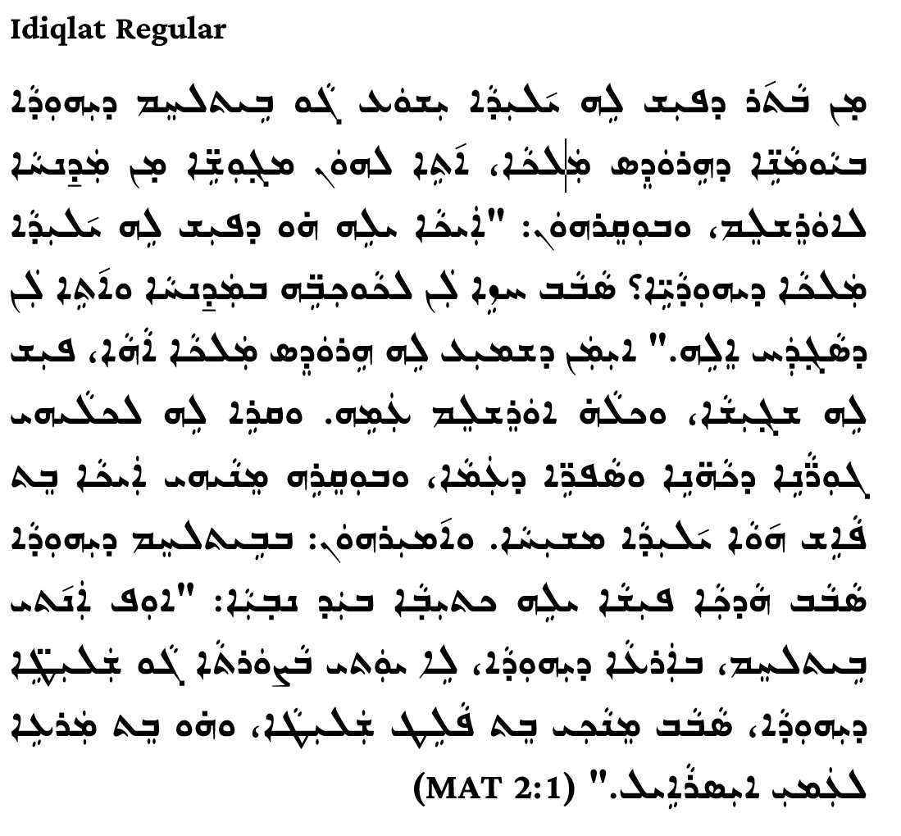
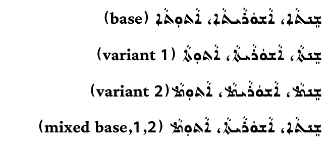
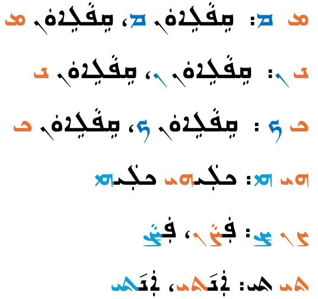

# Ramsina: A New East Syriac Font
We are pleased to announce the release of Ramsina, a new font for the East Syriac style of the Syriac script. Ramsina is a carefully crafted revival of metal type originally cut in India around 1920, faithfully preserving its historical character while meeting modern typographic standards. The original design, created by Esho Marcus and known as East Syriac Marcus, has been enhanced with advanced OpenType features developed by Sargon Hasso. This project was made possible through close collaboration with the SIL Writing Systems Technology group, whose expertise and dedication brought this initiative to fruition.

# Idiqlat: A New East Syriac Font
We are pleased to announce the release of Idiqlat, a new font for the East Syriac style of the Syriac script. 

Originally designed by Esho Marcus, the font has undergone substantial redesign to modernize its appearance and optimize performance for contemporary web and mobile environments. The typeface has been rescaled to align with standard point sizes used in modern fonts and is offered in multiple weights to support a wide range of typographic needs:

Idiqlat ExtraLight

Idiqlat Light

Idiqlat Regular

The name Idiqlat derives from ancient Akkadian/Assyrian and means “Tigris River,” with the stress on the first syllable (EE-dee-klat).

Idiqlat fully supports the complete set of Unicode characters required for the East Syriac style of the Syriac script. The original design, created by Esho Marcus and known as East Syriac Marcus, has been enhanced with advanced OpenType features developed by Sargon Hasso. This project was also made possible through close collaboration with the SIL Writing Systems Technology group, whose expertise and dedication brought this initiative to fruition.

# Advanced OpenType Features
This font includes advanced OpenType features that enable access to stylistic sets and alternate glyph variants in supported desktop publishing and word-processing applications, including Adobe InDesign, Microsoft Word, and LibreOffice Writer. These features provide fine-grained typographic control and support script-specific variants, such as alternate taw–alap forms in Syriac. Where supported by the application, stylistic alternates can be selected via the OpenType or font feature controls, allowing users to apply contextual, historical, or orthographic variants appropriate to editorial or scholarly requirements.

